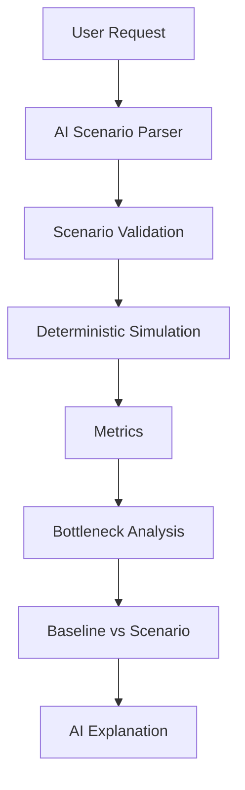

# SI-02 — Production Line Digital Twin & Bottleneck Intelligence

## Problem Statement
"Manufacturing lines consist of multiple interconnected stages. A delay or capacity limitation at one stage can propagate through the rest of the line and reduce overall throughput. Build a digital-twin prototype representing a multi-stage manufacturing line and use it to understand operational behaviour."

## Solution
This project provides a deterministic, browser-based discrete event simulation engine that models an interconnected multi-stage production line. It acts as a Digital Twin for exploring throughput losses, queue buildup, starvation, and bottlenecks. 

## Key Features
- **Deterministic Simulation Engine**: A custom TypeScript engine that simulates machine states (RUNNING, IDLE, BLOCKED, STARVED, DOWN) tick-by-tick.
- **Bottleneck Intelligence**: Automatically calculates and explains the line's primary constraint using a multi-factor analysis (utilization, upstream pressure, downtime).
- **What-If Lab**: Safely explore scenarios in a parallel simulation environment.
- **AI-Assisted What-If Lab**: Uses an LLM to interpret natural language requests into structured simulation scenarios and explain the numerical results.
- **Industrial UI Theme**: A professional, engineering-focused interface with Light/Dark mode and progressive disclosure of technical depth.

## System Architecture



## How the Simulation Works
The simulation executes locally within the browser. 
1. **Machines** process units at defined rates.
2. **Queues** sit between machines, acting as buffers. 
3. If a queue fills up, the upstream machine becomes `BLOCKED`.
4. If a queue empties, the downstream machine becomes `STARVED`.
5. Events (such as random breakdowns based on a deterministic seed) disrupt production flow.

## Bottleneck Intelligence
Bottlenecks are identified deterministically, *not* by AI guessing. The `BottleneckAnalyzer` ranks stages based on true utilization limits, queue starvation down-line, and blocking effects.

## AI-Assisted What-If Lab
Users can ask natural language questions (e.g., "What happens if Machine 2 is 20% slower?").
1. **Natural Language** is sent to the LLM.
2. The LLM generates a **Structured JSON Scenario**.
3. The engine **Validates** the JSON strictly against allowed parameters and bounds.
4. Two isolated, reproducible **Deterministic Simulations** (Baseline and Scenario) are run.
5. The actual numerical impact (Throughput, Bottleneck Shift) is calculated.
6. The AI provides a human-readable **Explanation** of the metrics.

*The deterministic simulation engine remains the source of truth for numerical results.*

## Technology Stack
- **Frontend**: React 19, TypeScript, Vite, Tailwind CSS v4, Zustand.
- **AI Provider**: Configurable for Ollama (Local) via standard fetch API.
- **Testing**: Vitest for robust unit testing of deterministic behaviors and AI validation.

## Project Structure
```text
src/
├── ai/
│   ├── prompts/
│   ├── provider/
│   ├── scenario/
│   └── validation/
├── components/
│   ├── common/
│   ├── layout/
│   └── simulation/
├── engine/ (Core Simulation Engine)
├── pages/
├── store/
└── types/
```

## Installation

```bash
cd frontend
npm install
```

## Running the Application

```bash
npm run dev
```

## Running Tests

```bash
npm test
```

## AI Setup
This project uses a flexible AI provider abstraction that defaults to a local Ollama instance.

1. Install Ollama locally (https://ollama.com).
2. Start the Ollama service and pull a model (e.g., `llama3.1`).
   ```bash
   ollama pull llama3.1
   ```
3. Set your environment variables in a `.env` file in the `frontend/` directory (optional if running locally with defaults):
   ```env
   VITE_AI_ENABLED=true
   VITE_OLLAMA_BASE_URL=http://localhost:11434
   VITE_OLLAMA_MODEL=llama3.1
   ```
   Note: Be sure your Ollama instance accepts CORS requests from your Vite server port.

## Example What-If Scenario
**User request:** "Make Inspection 20% slower"
**AI interpretation:** `{ "machineId": "s3", "parameter": "processingTimeSec", "operation": "multiply", "value": 1.2 }`
**Simulation:** Runs baseline (8 hours) vs scenario (8 hours).
**Result:** Throughput drops from 80/hr to 67/hr, queue upstream balloons.
**Explanation:** "By decreasing Inspection processing speed, the bottleneck shifted severely. The upstream queue filled, causing the previous machine to become blocked, resulting in a 16% drop in overall throughput."

## Validation / Testing
Unit tests verify:
- Deterministic simulation parity (same seed = identical results).
- Breakdown events appropriately disrupt identical seeds when parameters change.
- AI Scenario JSON is strictly validated (rejecting bad values, bad machines, negative capacities).

## Development Progress
- [x] Production line modeling
- [x] Machine/queue models
- [x] Deterministic simulation
- [x] Event processing
- [x] Metrics & Bottleneck analysis
- [x] What-If Lab & Scenario comparison
- [x] AI-assisted scenario parsing & explanation
- [x] Light/Dark industrial theme

## Development History
This project was developed iteratively for SI-02:
1. **Core Engine**: Initial architecture focused on translating a generic node-graph into a strict discrete-event simulation.
2. **Zustand & Visualization**: Decoupled the high-frequency tick loop from React rendering to support massive multi-hour runs instantaneously.
3. **What-If Lab**: Built isolated scenario testing to support engineering decisions.
4. **AI Integration**: Layered the LLM cleanly over the deterministic engine, ensuring numerical validity while massively improving usability.

## Problem Statement Alignment
- **Digital representation of production line**: Yes, configurable stages and interconnecting buffer queues.
- **Simulation of production behavior**: Yes, discrete-event ticking engine.
- **Bottleneck identification**: Yes, multi-factor deterministic logic.
- **Production performance analysis**: Yes, via Analytics and live KPIs.
- **What-if experimentation**: Yes, AI-assisted scenario testing.

## Limitations
- Prototype-level production model (fixed linear flow).
- AI depends on local availability and LLM compliance (though strict JSON validation catches errors gracefully).

## Future Work
- Real IIoT data integration for live production synchronization.
- Complex graph topologies (splits, merges) for the production line.
- Advanced failure distributions (Weibull) instead of simple uniform probabilities.
